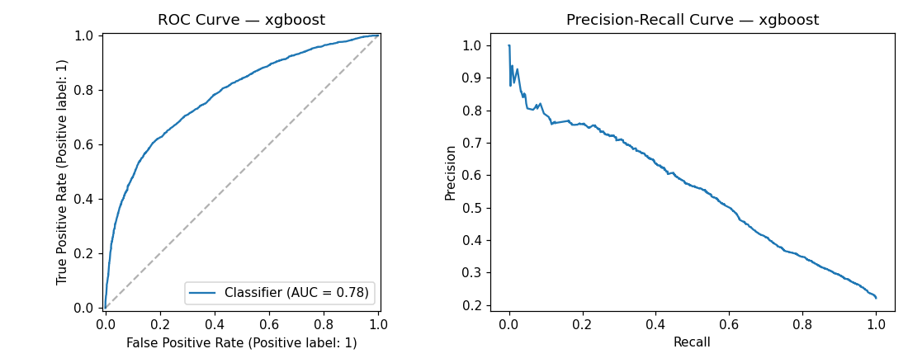
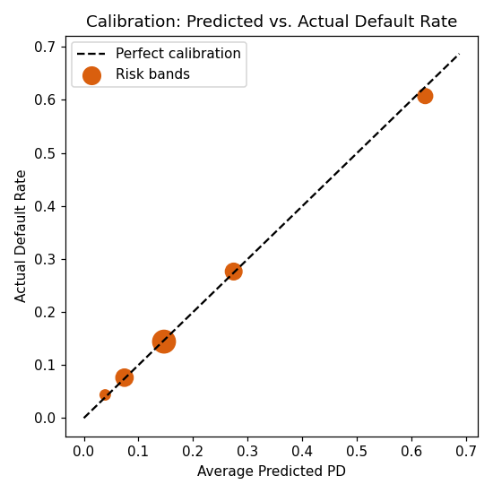
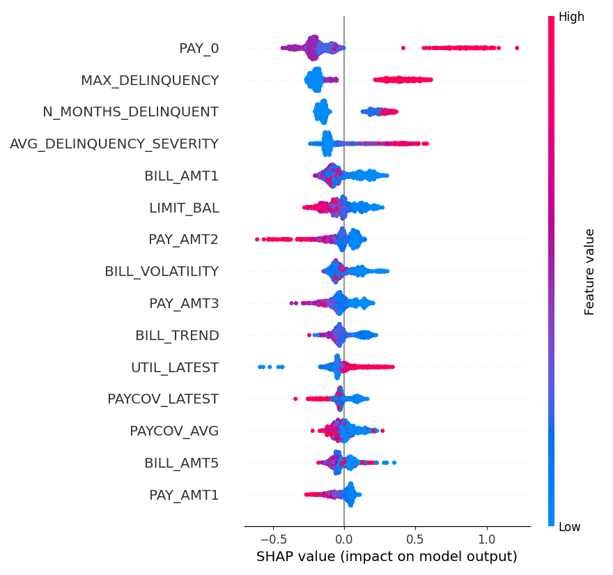
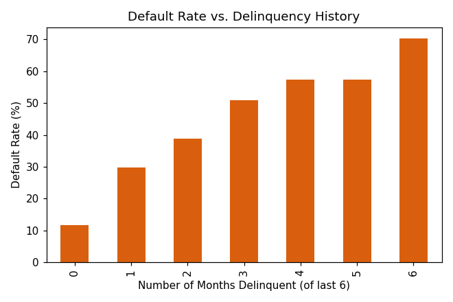
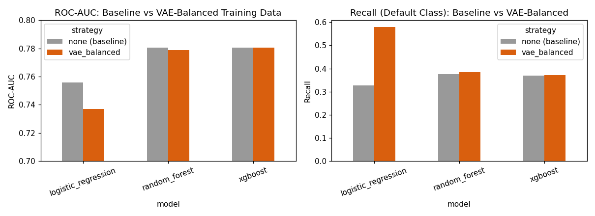

# Consumer Credit Risk Analytics & Probability of Default Modeling

*An independent consumer credit-risk analytics project using a publicly
available dataset. Not real Bank of America data, not a production system,
not a lending decision tool — a portfolio project demonstrating an
end-to-end PD modeling workflow, served via both a Streamlit dashboard and
a FastAPI service, containerized with Docker.*

## Business Problem

Banks need to estimate a consumer's Probability of Default (PD) to support
risk segmentation, early-warning monitoring, and capital/loss-provisioning
decisions. This project builds that workflow end to end — from raw data to
a calibrated PD model to a monitoring-aware dashboard and a real scoring
API — on a public dataset, at a scope appropriate for an entry-level
risk-analytics role.

## Dataset

[UCI / Kaggle "Default of Credit Card Clients"](https://www.kaggle.com/datasets/uciml/default-of-credit-card-clients-dataset) —
30,000 Taiwanese credit-card accounts, April–September 2005. 25 raw fields,
binary target (`default payment next month`, 22.12% positive rate).

## Results at a Glance

**Selected model: XGBoost**, class-weighted, isotonic-calibrated —
chosen over Logistic Regression and Random Forest, and over VAE-based or
SMOTE-based class-imbalance treatment, on real evaluated evidence (not by
default).

| Model | ROC-AUC | PR-AUC | KS | Recall | F1 |
|---|---:|---:|---:|---:|---:|
| Logistic Regression | 0.758 | 0.508 | 0.398 | 0.615 | 0.510 |
| Random Forest | 0.780 | 0.558 | 0.422 | 0.609 | 0.534 |
| **XGBoost (selected)** | **0.781** | **0.562** | **0.437** | 0.644 | **0.538** |

Isotonic calibration improved Brier score from **0.178 → 0.135** (24%
relative). Predicted PD tracks actual default rate within 1.7 percentage
points across all five reported calibration bands.




### What actually drives default risk

SHAP confirms delinquency history dominates every other predictor family —
consistent with the independent statistical tests (Cohen's d = 0.87 for
`N_MONTHS_DELINQUENT`, by far the largest effect size of any feature).




### Class imbalance: what was tried, and what won

Moderate imbalance (3.5:1) was investigated, not assumed to need treatment.
A **real VAE** (PyTorch — encoder/decoder network, reparameterization
trick, KL-regularized training, `src/vae_model.py`) was trained exclusively
on the minority (default) class, used to fully balance the training set,
and evaluated against all three models. It learned realistic per-feature
distributions (synthetic means within **0.059 standard deviations** of
real minority-class means) but did not improve — and for logistic
regression, worsened — classification performance versus simple
class-weighting.



**Verdict: class-weighting wins.** Full methodology, diagnostics, and the
complete comparison table (including SMOTE) are in
[`reports/model_validation_report.md`](reports/model_validation_report.md) §2.

## Architecture

```
Raw Data (CSV)
   -> Ingestion            (src/data_ingestion.py)
   -> Data Validation      (src/data_validation.py)      -> reports/data_quality_report.md
   -> Cleaning             (src/preprocessing.py)
   -> Feature Engineering  (src/feature_engineering.py)  -> 39 credit-risk features
   -> Statistical Analysis (src/statistical_analysis.py)
   -> Class Imbalance /
      VAE Experiment       (src/imbalance.py, src/vae_model.py,
                             src/run_vae_comparison.py)
   -> Modeling             (src/modeling.py)              -> LR / RF / XGBoost
   -> Evaluation           (src/evaluation.py)            -> ROC-AUC/PR-AUC/KS/Brier/PSI
   -> Explainability       (src/shap_explain.py)          -> SHAP
   -> Monitoring           (src/monitoring.py)
   -> Scoring              (src/scoring.py)               -> models/calibrated_model.joblib
   -> SQL Layer            (src/build_sql_db.py, sql/)    -> SQLite analytical DB
   -> Serving              (api/main.py)                  -> FastAPI scoring service
   -> Dashboard            (dashboard/app.py)             -> Streamlit + Groq AI Copilot
```

`src/scoring.py` is the single source of truth for "how a raw customer
record becomes a PD" — both the FastAPI service and the dashboard's
Customer Risk page call it, so there is one scoring code path, not two
that could silently drift apart.

A lightweight ETL pipeline (batch scripts, SQLite) was chosen deliberately
over a full data-warehouse architecture — 30,000 rows does not justify that
complexity.

## Feature Engineering

39 engineered features across five credit-risk-motivated families:
**utilization** (avg/max/min/latest/trend/volatility), **payment coverage**
(payment vs. prior bill, handling undefined ratios explicitly),
**delinquency** (months delinquent, max/avg severity, recency, persistence
flags), **balance & payment trend/volatility**, and **credit exposure**
(balance-to-limit, payment capacity, a combined utilization-stress flag).
Every feature's rationale is documented in `src/feature_engineering.py`.

## Modeling Methodology

- Stratified 75/25 split; all fitted transforms scoped to the training fold.
- Class imbalance: evidence-based comparison of no-resampling,
  class-weighting, and SMOTE — **class-weighting selected**. A real VAE
  was also trained on the minority class, used to fully balance the
  training set, and evaluated on all three model types — **rejected** on
  genuine downstream-performance evidence (see above and
  `reports/model_validation_report.md` §2).
- Three models compared: Logistic Regression (interpretable baseline),
  Random Forest, XGBoost.
- Isotonic calibration applied and validated against raw probabilities.
- Risk segmentation: 4 bands from the 50th/80th/95th percentiles of the
  **training-set** PD distribution (a circularity in an earlier version —
  using test-set quantiles — was found on review and fixed; see
  `reports/model_validation_report.md` §5).

## Risk Segmentation

| Band | Test Customers | Avg. Predicted PD | Actual Default Rate | % of Portfolio Exposure |
|---|---:|---:|---:|---:|
| Low Risk | 3,728 | 9.2% | 9.1% | 63.3% |
| Moderate Risk | 2,261 | 21.2% | 20.8% | 23.9% |
| High Risk | 1,152 | 50.7% | 49.9% | 9.9% |
| Very High Risk | 359 | 76.4% | 76.3% | 2.9% |

## Dashboard

Streamlit app (`dashboard/app.py`) with 9 pages: Executive Risk Overview,
Portfolio Analytics, Risk Segmentation, PD Model (incl. SHAP), Class
Imbalance/VAE, Model Monitoring, Customer Risk (with per-customer SHAP
explanation), the **CreditRisk AI Copilot**, and Methodology.

### AI Copilot

A Groq-powered conversational layer (`src/llm/groq_client.py`) that
**explains verified analytical outputs — it does not calculate risk
itself.** Architecture:

```
DATA -> ANALYTICS/ML -> VERIFIED METRICS -> LLM EXPLANATION
```

- Given a structured JSON context (portfolio stats, model metrics,
  risk-segment summaries, SHAP/coefficient drivers, monitoring results,
  and — when a customer is selected — that customer's model output) and
  instructed never to fabricate numbers, never to compute PD itself, and
  never to issue a lending decision.
- If `GROQ_API_KEY` is missing or the API call fails, the copilot page
  shows a clear unavailable message; **every other page keeps working.**
- **Security:** API key read from `GROQ_API_KEY` env var / Streamlit
  secrets only, never hard-coded. `.env` is gitignored.

#### Setup
```bash
pip install -r requirements.txt
cp .env.example .env   # then fill in GROQ_API_KEY
```

## FastAPI Scoring Service

`api/main.py` exposes the trained, calibrated model as a REST API — the
same `src/scoring.py` pipeline the dashboard uses, so predictions match
exactly between the two surfaces.

### Endpoints

| Method | Path | Description |
|---|---|---|
| GET | `/health` | Liveness + whether the model artifact loaded |
| GET | `/model/info` | Model name, metrics, calibration, thresholds |
| POST | `/predict` | Score a single customer record |
| POST | `/predict/batch` | Score a list of customer records |
| GET | `/docs` | Interactive Swagger UI (auto-generated) |

### Run locally

```bash
pip install -r requirements.txt
uvicorn api.main:app --reload --port 8000
# then open http://localhost:8000/docs
```

### Example request

```bash
curl -X POST http://localhost:8000/predict \
  -H "Content-Type: application/json" \
  -d '{
    "ID": 1, "LIMIT_BAL": 20000, "SEX": 2, "EDUCATION": 2, "MARRIAGE": 1, "AGE": 24,
    "PAY_0": 2, "PAY_2": 2, "PAY_3": -1, "PAY_4": -1, "PAY_5": -2, "PAY_6": -2,
    "BILL_AMT1": 3913, "BILL_AMT2": 3102, "BILL_AMT3": 689,
    "BILL_AMT4": 0, "BILL_AMT5": 0, "BILL_AMT6": 0,
    "PAY_AMT1": 0, "PAY_AMT2": 689, "PAY_AMT3": 0,
    "PAY_AMT4": 0, "PAY_AMT5": 0, "PAY_AMT6": 0
  }'
```

```json
{
  "ID": 1,
  "predicted_pd": 0.7137,
  "risk_band": "Very High Risk",
  "predicted_class": 1,
  "disclaimer": "Model-based estimate from a portfolio/educational project. Not a real lending decision."
}
```

(Verified live against a running instance — this is a real response, not a
mocked example.)

## Docker

Two services, one Compose file. Each has its own Dockerfile because the
API and dashboard have different runtime footprints (the API doesn't need
plotting/dashboard libraries, and vice versa).

### Run both with Docker Compose (recommended)

```bash
cp .env.example .env        # optional — fill in GROQ_API_KEY for the AI Copilot
docker compose up --build
```

- API: http://localhost:8000/docs
- Dashboard: http://localhost:8501

### Run individually

```bash
# API only
docker build -f Dockerfile.api -t credit-risk-api .
docker run -p 8000:8000 credit-risk-api

# Dashboard only
docker build -f Dockerfile.dashboard -t credit-risk-dashboard .
docker run -p 8501:8501 --env-file .env credit-risk-dashboard
```

Both images install only `requirements.txt` (core runtime deps) — the
training-only libraries (torch, shap, matplotlib, imbalanced-learn) live
in `requirements-train.txt` and are **not** baked into either image,
keeping them lean since neither serving path needs to retrain anything.

## SQL Layer

A SQLite database (`data/processed/credit_risk.db`) built from the cleaned/
scored data, queried in `sql/analytical_queries.sql` for portfolio size,
default rate by segment, delinquency analysis, high-risk customer
identification, exposure concentration, and more.

## How to Run (full pipeline, from scratch)

```bash
pip install -r requirements-train.txt   # includes torch, shap, matplotlib, etc.

cd src
python3 data_validation.py          # data quality audit
python3 run_experiments.py          # full modeling pipeline (~1-2 min)
python3 eda_plots.py                # EDA + evaluation charts
python3 shap_explain.py             # SHAP explainability
python3 run_vae_comparison.py       # class-imbalance / VAE comparison (~1-2 min)
python3 build_sql_db.py             # SQLite analytical DB

cd ..
streamlit run dashboard/app.py      # or: uvicorn api.main:app --reload
```

If you only want to **serve** the already-trained model (no retraining),
`pip install -r requirements.txt` is enough — see the Docker section above.

## Project Structure

```
consumer-credit-risk/
├── data/
│   ├── raw/UCI_Credit_Card.csv
│   └── processed/            # cleaned/featured/scored CSVs + SQLite DB
├── src/
│   ├── data_ingestion.py
│   ├── data_validation.py
│   ├── preprocessing.py
│   ├── feature_engineering.py
│   ├── statistical_analysis.py
│   ├── imbalance.py            # class-weight/SMOTE comparison
│   ├── vae_model.py            # real PyTorch VAE (encoder/decoder, reparameterization)
│   ├── run_vae_comparison.py   # VAE-balanced training vs. baseline, all 3 models
│   ├── modeling.py
│   ├── evaluation.py
│   ├── shap_explain.py
│   ├── monitoring.py
│   ├── scoring.py              # single source of truth for record -> PD
│   ├── build_sql_db.py
│   ├── run_experiments.py      # end-to-end driver
│   └── llm/groq_client.py
├── api/
│   ├── main.py                 # FastAPI service
│   └── schemas.py              # request/response models
├── dashboard/app.py
├── sql/analytical_queries.sql
├── models/                     # saved model artifacts (.joblib)
├── reports/
│   ├── data_quality_report.md
│   ├── model_validation_report.md
│   ├── model_governance.md
│   ├── final_analysis.md
│   ├── resume_and_interview_prep.md
│   ├── experiment_results.json
│   ├── vae_comparison_results.json
│   └── figures/
├── Dockerfile.api
├── Dockerfile.dashboard
├── docker-compose.yml
├── .env.example
├── requirements.txt             # runtime (API + dashboard)
├── requirements-train.txt       # + torch/shap/matplotlib/imbalanced-learn
└── README.md
```

## Limitations

Dataset is a single 2005 Taiwanese snapshot with no macroeconomic inputs,
no real LGD/EAD data, and no out-of-time validation window. The 0.5
classification threshold is not cost-tuned. Full discussion in
`reports/final_analysis.md` → Limitations and
`reports/model_validation_report.md` §8 (Known Issues).

## Future Improvements

- Real out-of-time validation once a second time period is available.
- Threshold tuning against an explicit cost-of-error business analysis.
- Re-run the class-weight vs. SMOTE comparison directly on Random Forest
  and XGBoost (currently verified for the VAE comparison, but the original
  class-weight/SMOTE ablation is still logistic-regression-only).
- Model-agnostic fairness mitigation techniques if production fairness
  monitoring surfaces a persistent gap.
- API authentication/rate-limiting if this were ever exposed beyond a
  local demo.
